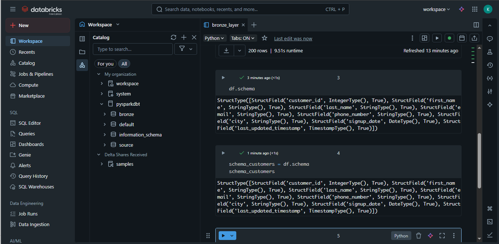
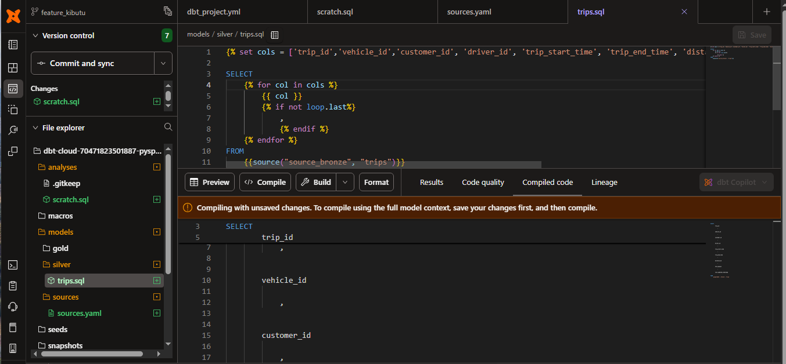

# End-to-End Data Engineering Project — PySpark, Databricks & dbt

This repository contains an **end-to-end data engineering pipeline** that integrates **PySpark**, **Databricks**, and **dbt Cloud** to design a scalable medallion architecture (Bronze → Silver → Gold).  
The goal is to simulate **real-world analytics engineering and data transformation workflows**, delivering **business-ready KPIs** and **incremental, production-grade data pipelines**.

---

## 🧩 Project Overview

This project demonstrates how to build a **modern data engineering pipeline** that ingests raw streaming data, transforms it using PySpark and dbt, and exposes key business insights through a Gold layer.  
It showcases how to handle real-world challenges like incremental loading, deduplication, and change tracking while maintaining transparency, modularity, and scalability.

### 🔗 Pipeline Overview

The full pipeline flow is as follows:
1. **Bronze Layer (Raw Ingestion):**  
   Data is streamed into the data lake (CSV files via PySpark Streaming) and stored as Delta tables.
2. **Silver Layer (Transformation & Cleansing):**  
   Cleaned and standardized data using dbt models (`trips.sql`), materialized incrementally with Jinja templating and logic.
3. **Gold Layer (Business KPIs):**  
   Aggregated tables with business metrics for decision-making, built with Jinja loops, conditional logic, and dbt snapshots.

---

## 🖼️ Visual Architecture


---

## 🏗️ Bronze Layer — Data Ingestion

The **Bronze Layer** captures raw streaming data from CSV files using PySpark Streaming and stores them in a Databricks data lake as Delta tables.

Key highlights:
- Streaming ingestion using `readStream()`
- Schema enforcement for consistency
- Storage in `/mnt/bronze/` path for downstream use


---

## ⚙️ PySpark Streaming & Schema Definition

PySpark Streaming enables continuous ingestion and schema validation for the incoming trip data.


**Schema Example:**



---

## 🧠 Silver Layer — Transformation (dbt + Jinja)

The **Silver Layer** focuses on cleansing, enriching, and incrementally updating the data.

We use **dbt Cloud** (Studio & CLI) to manage models and transformations, connecting directly to Databricks.

Example model:  
`models/silver/trips.sql`
```sql
{{ 
    config(
        materialized='incremental',
        unique_key='trip_id'
    )
}}



SELECT 
    
        {{ col }}
        ,
    
FROM {{ source("source_bronze", "trips") }}


WHERE last_updated_timestamp > (
    SELECT COALESCE(MAX(last_updated_timestamp), '1900-01-01') FROM {{ this }}
)


````

This approach ensures:

* Incremental materialization (only new data processed)
* Source tracking via `source()` definitions
* Dynamic column selection via Jinja loops

<p align="center">  </p>

---

## 🏅 Gold Layer — Business KPIs & Insights

The **Gold Layer** produces three key business views designed to simulate real-world analytical dashboards.

| View                      | Purpose                | Key Metrics                                       |
| ------------------------- | ---------------------- | ------------------------------------------------- |
| `trip_revenue_kpis`       | Financial overview     | Total fare, average fare, total distance          |
| `trip_driver_performance` | Workforce productivity | Total trips, revenue per km, performance category |
| `trip_customer_trends`    | Customer retention     | Average spend, loyalty segmentation               |

Each model uses **Jinja conditions and loops** for reusable logic and **dbt snapshots** to maintain historical changes.

<p align="center">  </p>

---

This approach ensures:

* Incremental materialization (only new data processed)
* Source tracking via `source()` definitions
* Dynamic column selection via Jinja loops


---

## 🏅 Gold Layer — Business KPIs & Insights

The **Gold Layer** produces three key business views designed to simulate real-world analytical dashboards.

| View                      | Purpose                | Key Metrics                                       |
| ------------------------- | ---------------------- | ------------------------------------------------- |
| `trip_revenue_kpis`       | Financial overview     | Total fare, average fare, total distance          |
| `trip_driver_performance` | Workforce productivity | Total trips, revenue per km, performance category |
| `trip_customer_trends`    | Customer retention     | Average spend, loyalty segmentation               |

Each model uses **Jinja conditions and loops** for reusable logic and **dbt snapshots** to maintain historical changes.


---

## ⚡ Materialization & Snapshots

Materialization strategy in dbt ensures efficient data updates:

* **Bronze & Silver:** Incremental materialization using unique keys.
* **Gold:** Snapshot-based updates for time-travel and trend analysis.


---

## 🌍 Real-World Impact & Learnings

### 🔧 Real-World Problem Solving

This pipeline reflects real-world data engineering solutions:

* **Reliable data lineage:** dbt sources and lineage graphs provide traceability.
* **Incremental & cost-efficient:** Only new data loads—ideal for large streaming systems.
* **Business-ready insights:** KPIs in the Gold layer empower finance, ops, and product teams.
* **Governance & testing:** Built-in dbt tests and documentation enhance data trust.
* **Scalable design:** Follows Databricks Medallion Architecture—extendable to enterprise scale.

### 🎓 What I Learned

Building this project has helped me:

* Master **dbt incremental models**, **snapshots**, and **Jinja templating**.
* Understand **Databricks Delta Lake** and **PySpark Streaming** for structured streaming.
* Learn **data modeling, testing, and documentation** in dbt Cloud.
* Apply real-world engineering practices like **source control**, **versioning**, and **environment management**.

### 💼 Why it Matters

This project mirrors how modern companies manage their data ecosystems—turning raw events into actionable insights with reproducible, testable, and efficient pipelines.
It demonstrates my ability to design, document, and operationalize **end-to-end data engineering workflows** using **industry-grade tools**.

---

## 🧱 Project Structure

```
pyspark-dbt-project/
│
├── models/
│   ├── bronze/
│   ├── silver/
│   │   └── trips.sql
│   ├── gold/
│   │   ├── trip_revenue_kpis.sql
│   │   ├── trip_driver_performance.sql
│   │   └── trip_customer_trends.sql
│
├── macros/
│   └── custom_utils.py
│
├── seeds/
├── snapshots/
├── data/
├── images/
│   ├── bronze_layer_ingestion.png
│   ├── pyspark_streaming.png
│   ├── schema.png
│   ├── jinja.png
│   ├── dbt_snapshots.png
│   ├── dbt_run.png
│   ├── databricks_gold_layer.png
│   └── pipeline_project.png
│
└── README.md
```

---

## 🧠 Key Takeaways

* ✅ **End-to-End coverage:** Raw ingestion → Transformation → KPIs
* 🧰 **Tools used:** PySpark, dbt Cloud, Databricks, Delta Lake
* 🔄 **Incremental processing:** Upsert logic with unique keys
* 📊 **Real insights:** Revenue, driver, and customer behavior metrics
* 📈 **Enterprise-ready:** Scalable medallion design with modular dbt models

---

## 🤝 Contact / Author

**Fred Kibutu (KibutuJr)** — Project Owner & Implementer

* 💼 **GitHub:** [KibutuJr](https://github.com/KibutuJr)
*  [🌐 **Portfolio:**](https://kibutujr.vercel.app/)
*  [💬 **LinkedIn:**](https://www.linkedin.com/in/fred-kibutu/)
*  [📧 **Email:**](mailto:kibutujr@gmail.com)
* 🗂️ **Repository:** [pyspark-dbt-project](https://github.com/KibutuJr/pyspark-dbt-project.git)

---

> ⚡ *This repository serves as a real-world blueprint for building scalable, maintainable, and business-driven data pipelines using PySpark, Databricks, and dbt Cloud.*

```

